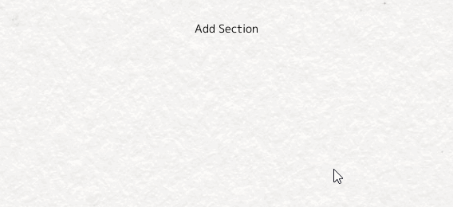
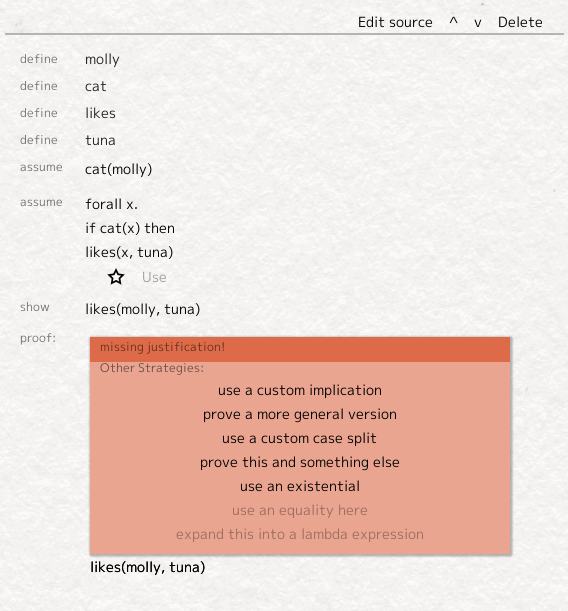
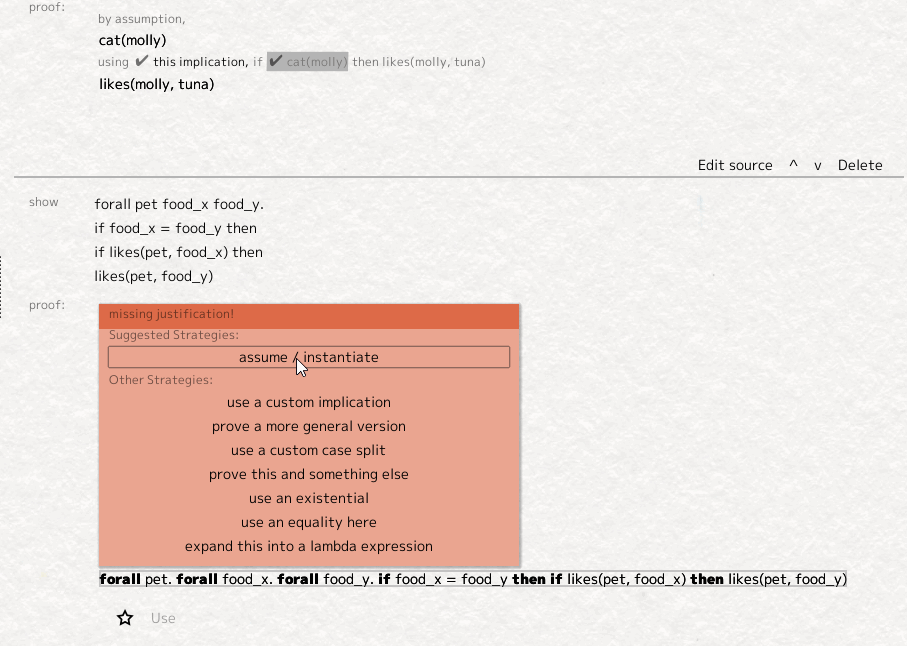

.. Math Playground documentation master file, created by
   sphinx-quickstart on Thu Sep  1 19:19:57 2022.
   You can adapt this file completely to your liking, but it should at least
   contain the root `toctree` directive.

About
------
There are two ways that Math Playground is a 'playground':

Firstly, it is a 'playground' in that I'm intending for this to be a program in which doing formal proofs is so natural it allows you to experiment and not plan out your proofs.

Secondly, it is a 'playground' in that I, as a developer, am constantly toying with it, adding new features. It's a prototype, and the focus is user-friendliness, not correctness (though anything incorrect is still a bug).

I hope it provides inspiration for what proof assistants could look like, and if I get more time, it would be nice for this to turn into an actual proof assistant interface further down the line.

Getting Started
---------------

To begin either go to `https://negabinary.github.io/Math-Playground/ <https://negabinary.github.io/Math-Playground/>`_ to use the web version or download the latest Windows release from `https://github.com/Negabinary/Math-Playground/releases <https://github.com/Negabinary/Math-Playground/releases>`_. Math Playground was built with a game engine, Godot, so I can target other platforms on request. (Note that in the online version, all files are stored in the browser somehow, so it is not possible to download/share files. I'm working on fixing that.)

The first time you open Math Playground, download the standard library using the button at the top right. Now you're all set!

Start by creating a new Section using the 'Add Section' button. A box will appear where you can specify what you want to prove. There are four commands you can use to specify a proof: :code:`define`, :code:`assume`, :code:`show`, :code:`import`.

You can use the :code:`define` command to create new identifiers. Everything is an identifier, including objects, predicates, functions, types, etc. ::
   
   define molly
   define cat
   define likes
   define tuna

You can use the :code:`assume` command to create new assumptions. It's my fault if a finished proof is wrong, but it's your fault if an assumption is wrong, so check your assumptions! ::

   assume cat(molly)
   assume forall x. if cat(x) then likes(x, tuna)

In the above example, we've used the built-in :code:`forall _ . _` and :code: `if _ then _` commands. `if _ then _` is how implication is represented in this language.

Finally, you can use the :code:`show` command to create a new goal to prove. ::
   
   show likes(molly, tuna)

When ready, you can compile the cell using the 'parse' button at the top of the cell (or by pressing Ctrl+Enter), and then you can start proving the open goals.

This goal is a very easy goal to prove. Select 'likes' on the open goal, then select 'Use' on the relevant rule to prove it.

Let's look at a more complicated example: ::

   show forall pet food_x food_y. 
      if food_x = food_y then 
      if likes(pet, food_x) then 
      likes(pet, food_y)

To prove a statement is true for every :code:`pet`, we imagine we have a pet, and then show that the statement is true. Likewise, to prove :code:`if X then Y`, we assume :code:`X` is true, then prove :code:`Y`. To do both of these, we use the button at the top-left of the 'missing justification' box.

Now we have a much simpler goal, :code:`likes(pet, food_y)`, and we've assumed the very similar statement, :code:`likes(pet, food_x)`, all we need to do now is exchange :code:`food_y` for :code:`food_x`. This can be done by clicking on :code:`food_y` in the goal and then using the '<==' rewrite rule on the equality.

And we've proved it!

The standard library is a little bit lacking for now, but if you have a file you want to import, you can use the :code:`import` command. ::

   import std.arith.peano

   show + 1 1 = 2

.. toctree::
   :maxdepth: 2
   :caption: Contents

   index.rst
   basics/commands.rst
   basics/statements.rst
   basics/expressions.rst